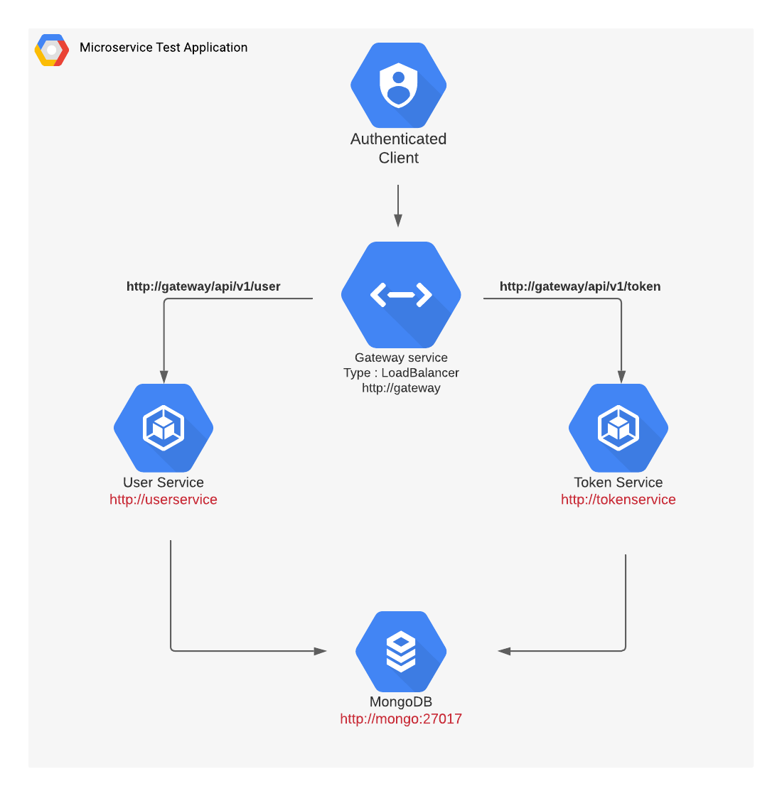
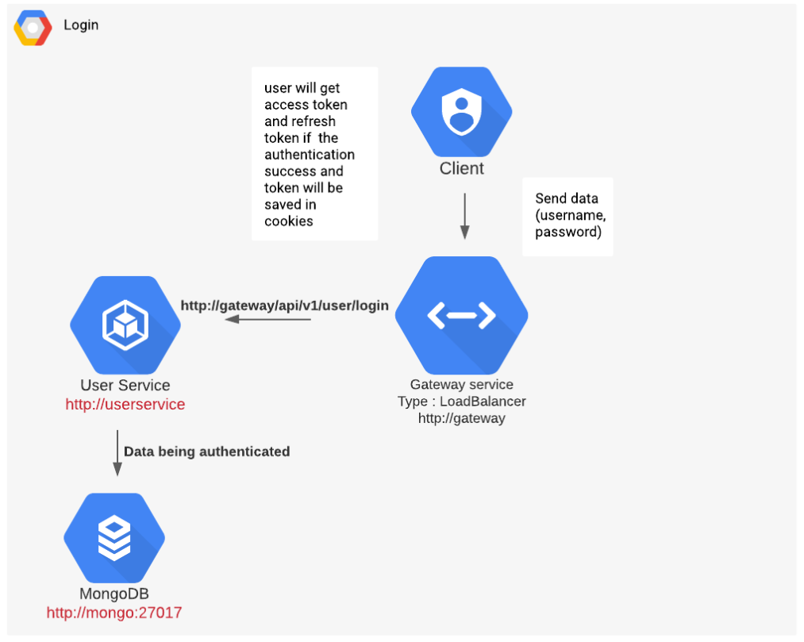
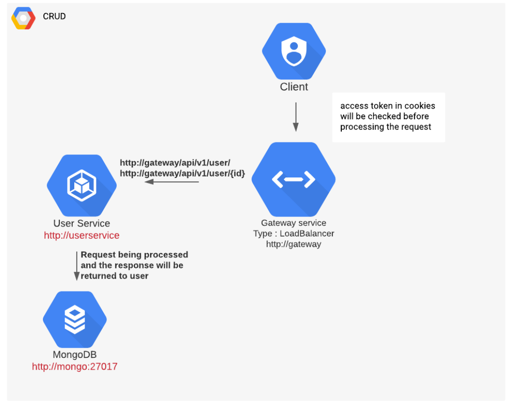

# Microservice-test

API Documentation : https://app.swaggerhub.com/apis-docs/scys12/MicroserviceAPI/1.0.0#/

URL Gateway: http://a8af3cb54b0cc440cb01ff3e13efe72e-53963905.us-east-1.elb.amazonaws.com

## Admin Credentials

- email : admin@mail.com
- password: admin123

## Architecture

- Using AWS EKS for creating Cluster.
- There are 4 pods, where each pod connected to one service, except for gateway pod.
- Only gateway service can interact with outside connection, while the rest of the services interact with internal IP.

## Application Flow

### Login Flow

1. Login to http://gateway/api/v1/user/login, with request body username and password

2. User will get access token and refresh token if the authentication success and the tokens will be saved in cookies.

3. When access_token expired from cookies, user can request to http://gateway/api/v1/token/refresh-token as long as refresh_token still in cookies.

4. When logout through http://gateway/api/v1/user/logout, access_token and refresht_token will be deleted from cookies.

### CRUD Flow

1. Access the endpoints for CRUD with URL http://gateway/api/v1/user/ or http://gateway/api/v1/user/{id}

2. Access token in cookies will be checked before processing the request.

3. When access_token expired from cookies, user can request to http://gateway/api/v1/token/refresh-token as long as refresh_token still in cookies.

4. Request being processed and the response will be returned to user

## Local Development

1. Install docker from [here](https://docs.docker.com/get-docker/).

2. Install kubectl as Kubernetes CLI from [here](https://kubernetes.io/docs/tasks/tools/)

3. Install minikube for local development cluster of k8s. Install from [here](https://minikube.sigs.k8s.io/docs/start/)

4. Install Skaffold as CI/CD for building/deploying image registry. Install it from [here](https://skaffold.dev/). Skaffold will be useful when building many images when there are some changes in image directory.

5. Clone this project and run `cd microservice-test`

6. Run docker and kubectl. Then start minikube with `minikube start`

7. Run `skaffold dev --port-forward`. Skaffold will handle the rest.

8. Check whether resource has been up & running with `kubectl get all -n sejuta-cita`

9. Access the gateway through http://localhost:8080. For the list API, see API Documentation
